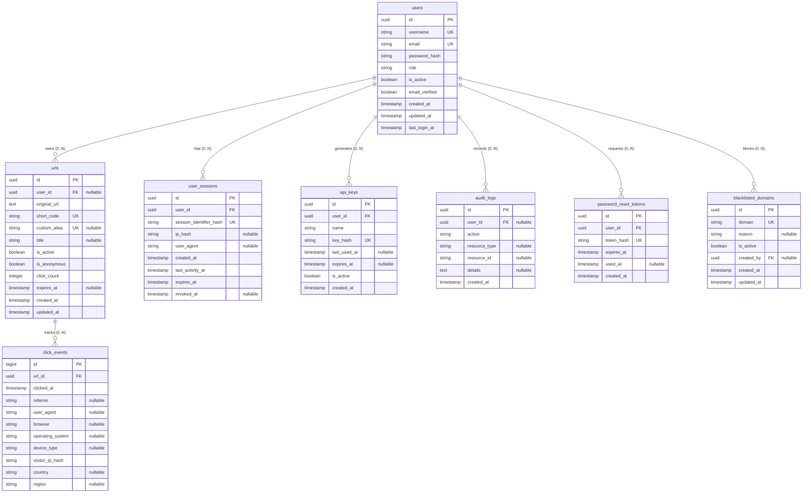

# Sniply Entity Relationship Diagram (ERD)

This diagram visualizes the entity relationships, keys, and foreign key dependencies within the **Sniply** PostgreSQL database.

```mermaid
erDiagram
    users ||--o{ urls : "owns (0..N)"
    users ||--o{ user_sessions : "has (0..N)"
    users ||--o{ api_keys : "generates (0..N)"
    users ||--o{ audit_logs : "records (0..N)"
    users ||--o{ password_reset_tokens : "requests (0..N)"
    users ||--o{ blacklisted_domains : "blocks (0..N)"

    urls ||--o{ click_events : "tracks (0..N)"

    users {
        uuid id PK
        string username UK
        string email UK
        string password_hash
        string role
        boolean is_active
        boolean email_verified
        timestamp created_at
        timestamp updated_at
        timestamp last_login_at
    }

    urls {
        uuid id PK
        uuid user_id FK "nullable"
        text original_url
        string short_code UK
        string custom_alias UK "nullable"
        string title "nullable"
        boolean is_active
        boolean is_anonymous
        integer click_count
        timestamp expires_at "nullable"
        timestamp created_at
        timestamp updated_at
    }

    click_events {
        bigint id PK
        uuid url_id FK
        timestamp clicked_at
        string referrer "nullable"
        string user_agent "nullable"
        string browser "nullable"
        string operating_system "nullable"
        string device_type "nullable"
        string visitor_ip_hash
        string country "nullable"
        string region "nullable"
    }

    blacklisted_domains {
        uuid id PK
        string domain UK
        string reason "nullable"
        boolean is_active
        uuid created_by FK "nullable"
        timestamp created_at
        timestamp updated_at
    }

    user_sessions {
        uuid id PK
        uuid user_id FK
        string session_identifier_hash UK
        string ip_hash "nullable"
        string user_agent "nullable"
        timestamp created_at
        timestamp last_activity_at
        timestamp expires_at
        timestamp revoked_at "nullable"
    }

    api_keys {
        uuid id PK
        uuid user_id FK
        string name
        string key_hash UK
        timestamp last_used_at "nullable"
        timestamp expires_at "nullable"
        boolean is_active
        timestamp created_at
    }

    audit_logs {
        uuid id PK
        uuid user_id FK "nullable"
        string action
        string resource_type "nullable"
        string resource_id "nullable"
        text details "nullable"
        timestamp created_at
    }

    password_reset_tokens {
        uuid id PK
        uuid user_id FK
        string token_hash UK
        timestamp expires_at
        timestamp used_at "nullable"
        timestamp created_at
    }
```

